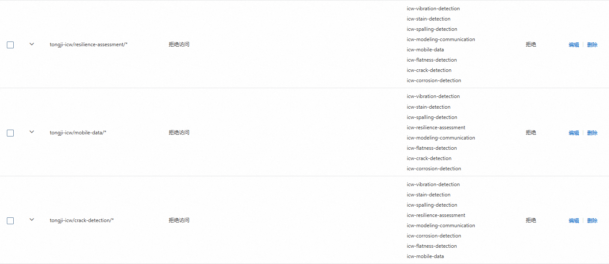
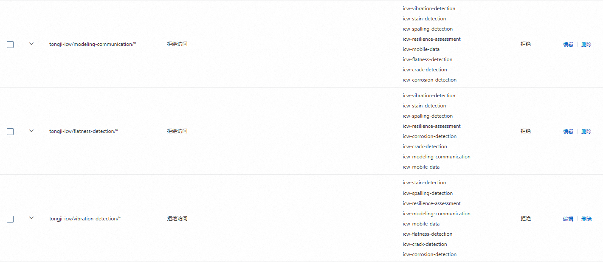
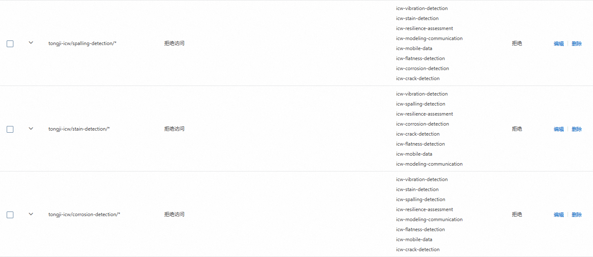

# OSS Management Console System

Intelligent Curtain Wall: OSS management console system (backend application)

智慧幕墙：对象存储 OSS 管理控制系统（后端应用程序）

> [!WARNING]
> Do not modify this README.md file!
>
> 禁止修改本 README.md 文件！

> [!IMPORTANT]
> Git submodules allow you to nest another independent Git repository within a Git repository, making it easier to manage project dependencies. The integrating Git repository references the latest version of this subsystem Git repository to ensure that the code used during building and running is up to date.
>
> Git 的子模块（submodule）允许在一个 Git 仓库中嵌套另一个独立的 Git 仓库，便于管理项目依赖。集成 Git 仓库引用了本子系统 Git 仓库的最新版本，以便在构建和运行时确保使用的代码是最新的。

## 成员信息

| 姓名 | 学号 |
| :---: | :---: |
| [林继申](https://github.com/MinmusLin) | 2250758 |
| [刘淑仪](https://github.com/bunnyoii) | 2251730 |
| [中谷天音](https://github.com/amaneosaka) | 2256225 |

## 对象存储 OSS 配置

### 配置 RAM 访问控制

#### 管理用户身份

创建子系统用户，选择“使用永久 AccessKey 访问”：

#### 管理用户组身份

创建 tongji-icw 用户组：

进行组成员管理：

进行权限管理：

### 配置 Bucket

#### 创建 Bucket

Bucket 基本信息：

#### 配置子系统目录

文件列表：

#### 配置权限控制

阻止公共访问：开启

Bucket ACL：私有

Bucket 授权策略：

#### 配置跨域规则

跨域规则：

